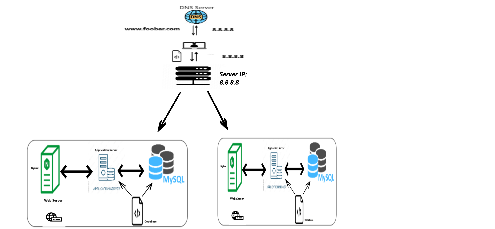

## specifics about this infrastructure:

# What distribution algorithm your load balancer is configured with and how it works 
A load balancer algorithm is a mathematical formula or rule used to distribute traffic across multiple servers or resourses.This algorithm works by in a Round Robin distribution, incoming requests are evenly distributed in a circular order to each server in the backend pool. It's a simple and effective method for distributing traffic

# Is your load-balancer enabling an Active-Active or Active-Passive setup, explain the difference between both:
HAProxy, as a load balancer, is typically used to enable an Active-Passive setup rather than an Active-Active setup.
Active-Active Setup: All nodes (servers or instances) are active and capable of receiving and processing traffic simultaneously.
Active-Passive Setup:Only one node is active (the primary node), and the others are passive (standby or backup nodes).

# How a database Primary-Replica (Master-Slave) cluster works:
A Primary-Replica (Master-Slave) database cluster is a configuration used to enhance database performance, fault tolerance, and data redundancy. 
 the primary node is responsible for handling write operations, maintaining data consistency, and ensuring data durability. It serves as the authoritative source for data changes.The replica nodes focus on serving read operations, improving query response times, providing data redundancy.

# What is the difference between the Primary node and the Replica node in regard to the application:
 the primary node is responsible for handling write operations, maintaining data consistency, and ensuring data durability.
 The replica nodes focus on serving read operations, improving query response times, providing data redundancy, and supporting high availability through failover mechanisms.

## the issues are with this infrastructure:
 
SPOF:
If the Primary MySQL database server experiences downtime, the entire website would lose the ability to manage site operations, including user management tasks

Security issues (no firewall, no HTTPS):
The absence of a firewall on any of the servers means there is no mechanism in place to block unauthorized IP addresses from accessing the network.The data transmitted over the network is not protected with SSL encryption, making it vulnerable to eavesdropping by potential hackers.

No monitoring:
Means we do not receive alerts about anomalies, and it hampers our ability to proactively manage server health and capacity.