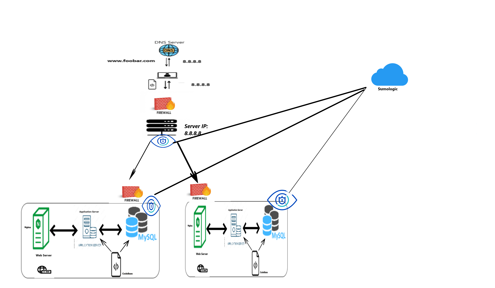

## Specifics about this infrastructure:

# What are firewalls
Firewall is network security device that monitors and filters incoming and outgoing network traffic based on a organization previously established security policies.

# Why is the traffic served over HTTPS
HTTPS is focused on securing data in transit, ensuring data privacy, authentication, and data integrity.

# Monitoring
Monitoring serves to track the performance, health, and security of systems and applications. It provides real-time insights, identifies anomalies, and aids in proactive issue resolution.To monitor your web server's Query Per Second (QPS), select a monitoring tool like Prometheus, install and configure it, instrument your web server to export QPS metrics, define specific QPS metrics and thresholds, set up alerts for unusual activity, create visual dashboards, test in a controlled environment, deploy in production, regularly analyze data, and use historical QPS data for capacity planning.

## the issues are with this infrastructure:

Why terminating SSL at the load balancer level is an issue
Terminating SSL at the load balancer provides operational benefits, it's essential to be aware of the trade-offs, regarding security and privacy. 

Having one MySQL server is an issue because ensuring data availability, fault tolerance, and improved performance.

Having servers with all the same components, including database servers, web servers, and application servers,allows for customization of server resources, better resource allocation. 